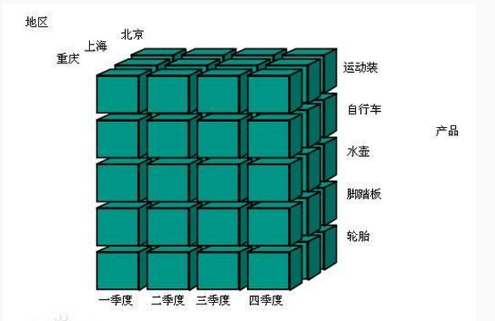
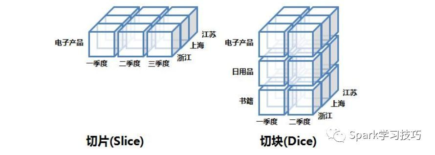
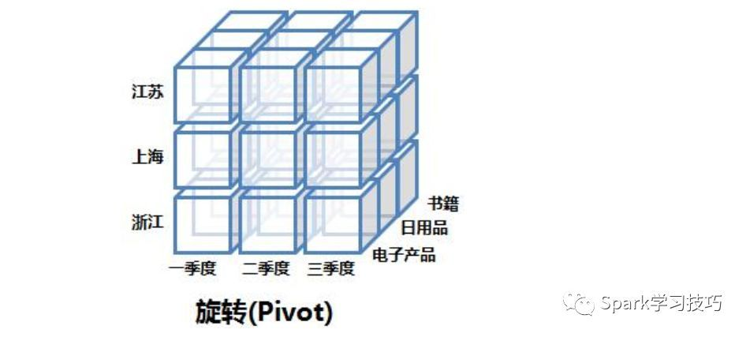
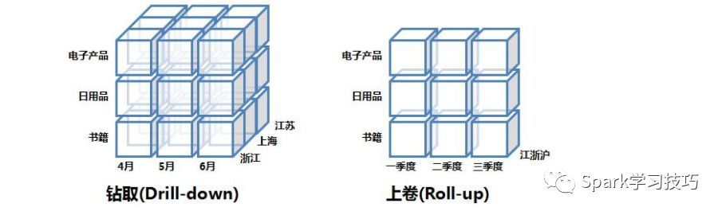
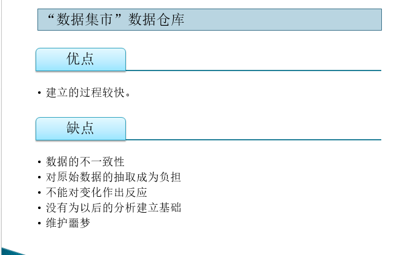
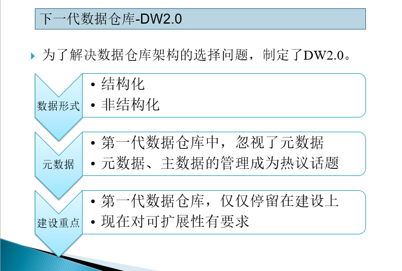

## 1. 数据仓库 - 定义

#### 1.1 数据仓库的定义

数据仓库，简称为DW（Data Warehouse的缩写），是一个很大的数据存储集合，通过对多样的业务数据进行筛选与整合，产出企业的分析性报告和各类报表，为企业的决策提供支持。

#### 1.2 数据仓库的一些特点

- 主题性

不同于传统的数据库是应用于某个项目，数据仓库则是围绕一个主题进行获取数据和分析数据，以此来满足数据分析的需求。

比如p2p平台一个月内发生了多少交易额，分析那个时间段内现金的流入和流出最高，

- 集成性

数据仓库会将不同的数据集通过ETL进行整合，做到数据的统一规范化、集成性，不会出现对于同一概念出现不同解释的情况

- 稳定性

数据仓库不允许对数据进行修改，只能进行查询和分析。

数据仓库的分析主要是OLAP的操作（后续章节会对OLTP和OLAP进行解释），侧重决策支持，并且提供直观易懂的查询结果

- 及时性

数据仓库一定要获取最新的数据，这样数据分析出来的结果才是有效的。

## 2.  数据仓库 - 粒度与分区

导言：在数据仓库设计过程中，有两个非常重要的因素需要考虑：粒度与分区；这决定了你的数据仓库设计的基本方案与思路

数据的粒度一直是一个设计问题。数据仓库环境中粒度之所以是主要的设计问题，是因为它深深地影响存放在数据仓库中的数据量的大小，同时影响数据仓库所能回答的查询类型。粒度的大小需要数据仓库在设计时在数据量大小与查询的详细程度之间作出权衡。

#### 2.1 粒度

所谓的粒度其实就是指数据的细化级别；粒度级别低 -> 细节程度高；粒度级别高 -> 细节程度低

例如：

一个制衣厂去采购一些原材料，假设一个采购单号会分多次去采购，每次采购记录的具体时间、物料类别、磅数、金额、原材料工厂、色号...等等的信息，这就是一个明细的数据，是高细节的数据；

如果将采购的数据进行一个轻度的汇总，例如按采购单号或者按照天/小时来统计分区维度内的总采购磅数、金额、单价...的信息，这就是相对低细节的数据

注：最低粒度级别即为真实档案

**粒度所能带来的好处：**

1. 可以从不同的角度来观察数据
2. 可以对数据一致性进行协调
3. 灵活性
4. 包含了整个企业的活动和事件历史
5. 可以容纳未来未知的需求（如果粒度设置比较合理，我们有较为明细的底层数据，那么就算未来有一些新的需求，我们也能依赖底层数据统计出所需的信息）

**粒度的双重级别：**

很多时候，十分需要提高存储与访问数据的效率，以及非常详细地分析数据的能力。当一个企业或组织的数据仓库中拥有大量数据时，在数据仓库的细节部分考虑双重(或多重)粒度级是很有意义的。事实上，需要多个粒度级而不是一个粒度级的需求，是因为粒度级设计采用双重级别应该是几乎每个机构默认的选择。

数据仓库在细节级别上一般分为两种级别：轻度汇总数据 与 真实档案

比如说：公司的主要交互数据是近一年的数据，而十年前、五年前数据的访问量很低，那么通常的设计是，高访问频率的数据以真实档案的形式来进行存储（一般放在性能较好的设备上以满足实时交互的需求），而低访问频率的数据一般以轻度汇总的形式进行聚合，具体是以什么样的形式，需要与DSS人员进行沟通，比较常见是按时间/地区/部门等来进行聚合（该部分数据一般放在价格相对低廉的设备以满足大量数据存储的需要）

**确定粒度级别：**

确定粒度级别开始时是需要一些常识和直觉的。在很低的细节级上建立轻度汇总的数据级是没有意义的，因为需要太多的资源来处理数据。而在太高的细节级上建立轻度汇总的数据级，则意味着许多分析必须在真实档案级上进行。因此确定轻度汇总的粒度级的第一件事是进行有根据的猜测。

但进行有根据的猜测也只是一个开端。还需要一定数量的反复分析来改进这个猜测。对于轻度汇总的数据为了确定合适的粒度级别，唯一可行的方法是将数据拿到最终用户的面前。只有当最终用户实际看到了数据之后，我们才能作出确定的回答。

对于数据怎样轻度汇总是没有限制的(限制只存在于设计者的脑海里)。
有一点很重要，在典型的需求系统的开发中，在还不清楚大部分需求之前就忙于进行是不明智的。但在数据仓库的建造中，如果已知了至少一半的需求后，还不开始同样也是不明智的。换句话说，在建造数据仓库中，如果开发者想等着大多数需求明了后才开始工作，那么这个仓库是永远建不起来的。尽快启动与DSS分析员（数据仓库用户，一般是有技术背景的需求人员）的反馈循环是非常重要的

Q1：为什么在设计数据仓库的时候不直接将明细数据进行整合，这样在未来不管有什么新增需求都可以满足？

理论上在设计数仓底层的时候，数据越明细越好；但是需要综合考量

数据的有效性（例如网页中记录用户行为的数据、日志等一系列的信息，其实是有很多的冗余的的数据，这部分数据可能要做一定的规范，提取出我们关心的指标）

存储设备的空间（不过现阶段存储设备的价格越来越低，数据分析的重要性越来越高，如果客户能够承担相应的存储设备的价格，那么一切好说）

#### 2.2 数据分区

**需要做数据分区的原因：**

数据仓库的本质之一就是灵活地访问数据。如果是大块的数据，就达不到这一要求。因而，对所有当前细节的数据仓库的数据都要进行分区。

简单的说数据分区对于可管理性、性能和可用性都会由极大的提升

**如何做数据分区：**

做数据分区常见的维度有：时间、主题、区域、组织单位...

其中时间维度是最常见的，一般会按照年月日的形式来进行分区，当然具体业务具体分析，最终敲定要与DSS人员商讨具体的分区策略

## 3. 数据仓库环境

#### 3.1 操作型窗口

定义：在操作型环境中的档案数据的时间范围称为数据的操作型窗口

操作型环境中的档案数据的时间范围不是在操作型环境中的档案数据和数据仓库环境中的档案数据间的唯一区别。不同于数据仓库操作型环境的档案数据的数据量不大，并且访问频繁

操作型窗口的长度对DSS分析员而言是非常重要的，因为它决定了分析员在哪里进行不同的分析和能做什么类型的分析。例如，DSS分析员能对在操作型窗口里找到的数据进行单项分析，而不能做大的长期趋势分析。操作型窗口的数据适于高效单个访问，只有当数据移出操作型窗口后，才适于进行大量数据的存储和访问

#### 3.2 数据仓库中的数据清理

数据并非永久的注入数据仓库，它在数据仓库中也有自己的生命周期。到了一定时候，数据将从仓库中清除。数据清理问题是数据仓库设计人员无法回避的基本设计问题之一。

从某种意义上讲，数据根本就没有从数据仓库中清除，而仅仅是上升到更高的综合级。数据清理或数据细节转化主要有以下几种方式

- 数据加入到失去原有细节的一个轮转综合文件中
- 数据从高性能的介质（如DASD）转移到大容量介质上
- 数据从系统中被真正的清除
- 数据从体系结构的一个层次转到另外的层次，比如从操作层转到数据仓库层

因而，在数据仓库环境之中有多种数据清理或者转化的方式。数据的生命周期（包括清除和最终档案转移）应该是数据仓库设计过程中活跃的一部分

## 4. 数据仓库中的一些术语

#### 1. 维度、度量

维度，是指描述对象的属性与特征，在实际运用中，就是分析数据，看待数据的的角度。例如，地理位置的维度可以包括“纬度”、“经度”或“城市名称”。“城市名称”维度的值可以为“旧金山”、“柏林”或“新加坡”。

度量，通常是指数值型的数据，例如采购订单金额、单价、测试值等

#### 2. OLAP与数据立方体

**数据立方体**

数据立方体，他是一种用于OLAP以及OLAP操作（如上卷、下钻、切片和切块）的多维数据模型。数据立方体存储多为聚集信息。每个单元存放一个聚集值，对应于多维空间的一个数据点。每个属性都可能存在概念分层，允许在多个抽象层进行数据分析。

数据立方体允许以多维对数据建模和观察。它由维和事实定义。一般而言，维是一个单位想要记录的透视或实体。通常，多维数据模型围绕诸如销售这样的中心主题组织。主题用事实表表示。事实是数值度量的。事实表包括事实的名称或度量，以及每个相关维表的码。存放最低层次汇总的方体称作基本方体

**OLAP**

- 背景：

OLAP是数据仓库系统的主要应用，支持复杂的分析操作，侧重决策支持，并且提供直观易懂的查询结果。

 联机分析处理的用户是企业中的专业分析人员及管理决策人员，他们在分析业务经营的数据时，从不同的角度来审视业务的衡量指标是一种很自然的思考模式。例如分析销售数据，可能会综合时间周期、产品类别、分销渠道、地理分布、客户群类等多种因素来考量。这些分析角度虽然可以通过报表来反映，但每一个分析的角度可以生成一张报表，各个分析角度的不同组合又可以生成不同的报表，使得IT人员的工作量相当大，而且往往难以跟上管理决策人员思考的步伐。

 好的BI产品在联机分析处理方面，其主要特点是直接仿照用户的多角度思考模式，预先为用户组建多维数据库，在这里，维指的是用户的分析角度。例如对销售数据的分析，时间周期是一个维度，产品类别、分销渠道、地理分布、客户群类也分别是一个维度。一旦多维数据模型建立完成，用户可以快速地从各个分析角度获取数据，也能动态的在各个角度之间切换或者进行多角度综合分析，具有极大的分析灵活性。

- 基本的操作：

OLAP在数据立方体中最常见的五大操作：切片，切块，旋转，上卷，下钻。

1.  切片和切块(Slice and Dice)

在数据立方体的某一维度上选定一个维成员的操作叫切片，而对两个或多个维执行选择则叫做切块。下图逻辑上展示了切片和切块操作：

2. 旋转(Pivot)

旋转就是指改变报表或页面的展示方向。对于使用者来说，就是个视图操作，而从SQL模拟语句的角度来说，就是改变SELECT后面字段的顺序而已。下图逻辑上展示了旋转操作：

3. 上卷和下钻(Rol-up and Drill-down)

上卷可以理解为"无视"某些维度（高度汇总层，例如由明细层-日、月的数据上卷到看年的数据）；下钻则是指将某些维度进行细分（下钻到低一度的层次来查看明细，例如由年度汇总数据下钻到每月、每日的情况）。下图逻辑上展示了上卷和下钻操作：

#### 3. 多维数据库模式

**一、概述**

　　多维数据模型是最流行的数据仓库的数据模型，多维数据模型最典型的数据模式包括星型模式、雪花模式和事实星座模式，本文以实例方式展示三者的模式和区别。

**二、星型模式（star schema）**

　　星型模式的核心是一个大的中心表（事实表），一组小的附属表（维表）。星型模式示例如下所示：

 

**三、雪花模式（snowflake schema）**

　　雪花模式是星型模式的扩展，其中某些维表被规范化，进一步分解到附加表（维表）中。雪花模式示例如下图所示：

从图中我们可以看到地址表被进一步细分出了城市（city）维。supplier_type表被进一步细分出来supplier维。

注：雪花型现在用的非常少，因为维度表中的字段本身就不多，没有必要维表嵌维表，这样在后期维护的时候会比较麻烦

**四、事实星座模式（Fact Constellation）或星系模式（galaxy schema）**

　　数据仓库由多个主题构成，包含多个事实表，而维表是公共的，可以共享，这种模式可以看做星型模式的汇集，因而称作星系模式或者事实星座模式。本模式示例如下图所示：

如上图所示，事实星座模式包含两个事实表：sales和shipping，二者共享维表。

**五、总结**

　　事实星座模式是数据仓库最常使用的数据模式，尤其是企业级数据仓库（EDW）。这也是数据仓库区别于数据集市的一个典型的特征，从根本上而言，数据仓库数据模型的模式更多是为了**避免冗余和数据复用**，套用现成的模式，是设计数据仓库最合理的选择。当然大数据技术体系下，数据仓库数据模型的设计，还是一个盲点，探索中。

#### 4. 数据仓库的变体 - DW1.0

**一、概述**

　　DW1.0中由于数据仓库技术未成熟，没有一个统一的很好的集成方案，因此产生了许多数据仓库的变体，主要有“主动”数据仓库，“联合”数据仓库，“星状”数据仓库，“数据集市”数据仓库

**二、”主动“数据仓库**

​	

主动数据仓库会提供联机事务处理的能力，相当于把ADS层的功能整合到了数据仓库层。

关于缺点：

1. 比如说当一个事务没有被正确执行的时候，有可能会对数据造成毁坏，支持回滚会非常困难
2. 事务直接在数据仓库中进行查询，由于数据仓库的数据量非常的大，会造成容量和资源的紧张

**三、“联合”数据仓库**

“联合”数据仓库仅仅是将多个源的数据进行UNION的操作，没有对数据进行整合，这就造成了许多的问题

**四、“星状”数据仓库**

星状数据仓库是基于事实星座型的多维数据库模式来进行构建的

关于缺点：

1. 脆弱性，一旦用户的需求发生了变更，例如增加一个字段之类的，那么数据就要从ODS -> DW -> ADS层逐层的进行修改，这就造成了其扩展性不是很好
   - 用户的需求发生变更是很正常的事情，因为一开始的数据仓库设计都不会是完美的，如果想一开始的设计就是完美的，那么设计的周期性和成本就会非常的高，这不符合实际的要求
2. 仅能对一类用户进行优化，
   - 数据仓库在需求调研时往往是为了满足某一类的用户的而进行设计的，因此只有对某一类用户而言，所给的星型模式是最优的，那么对于其他用户而言，都不是最优的
   - 而建立一个星状数据仓库很难做到能够令大多数用户都满意的，

3. 混乱的粒度
   - 为了满足绝大多数用户的需要，往往在数仓中构建多个星型模型，这就造成了面对不同用户的星状模型会有不同的统计粒度，导致了混乱的粒度。也因此多个星状数据模型只有在最低级的粒度上才是有用的

综上，星状数据仓库从长期的角度上看还是会有很多的问题

**五、“数据集市”数据仓库**

即把数据集市当做了数据仓库，这种是几乎没有办法整合不同数据集市之间的关系

**六、总结**

