## 1. 数据仓库的总体架构概述

数据仓库的工作主要分为两大部分

- 操作型系统接口的设计
- 数据仓库本身的设计
  - 过程模型
  - 数据模型

### 1.1 操作型系统接口的设计

该部分主要讲解数据怎么进来，然后说明对接业务系统时候的出现的一些问题：

对接业务系统的时候最容易出现的问题是**数据的整合**，由于不同业务库在早期的时候都是一座信息孤岛，没有做到统一的规范，所以在做数仓的时候需要对数据进行整合，以此来保证数据质量

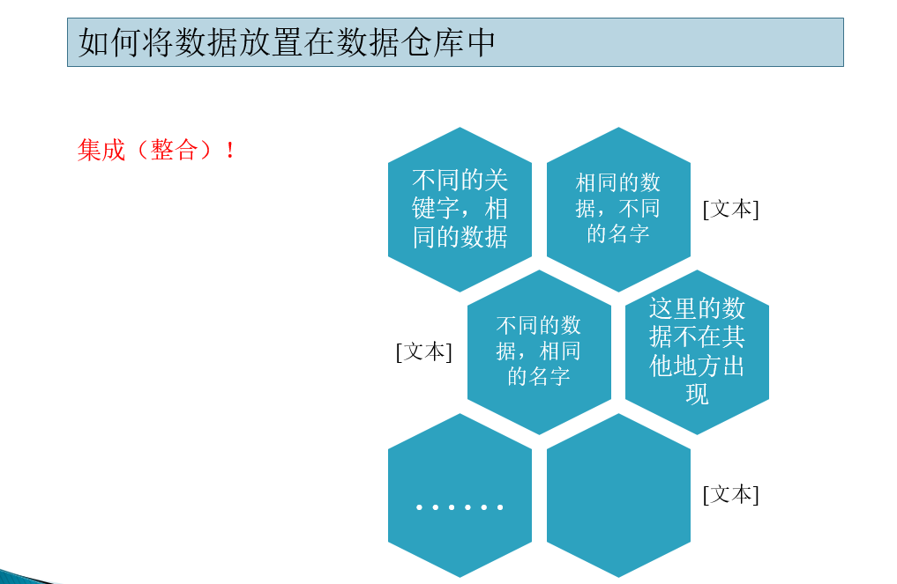

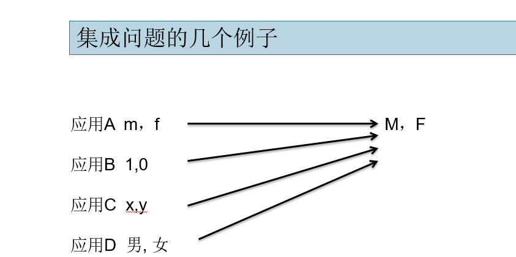

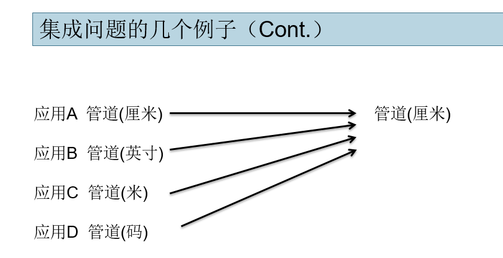

在对接业务库的时候，主要的两个工作就是：

- 数据转换
- 访问现有数据库的效率

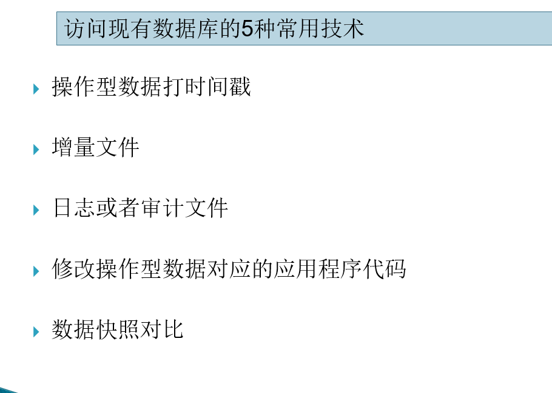

### 1.2 数据仓库本身的设计

数据仓库本身的设计

- 过程模型 -> 不适用

- 数据模型

  

#### 1.2.1 过程模型

一个过程模型包含以下内容：

- 线性顺序、原型实现、快速应用
- 增量、螺旋、并发任务、构建任务、形式化

过程模型更适用于数据库，过程模型都是需求驱动的，都要在开发前确认好明确的需求。但是数据仓库的开发（或者说需求）就是迭代式的，一开始不会有很明确的需求

**结论：过程模型不适用于数据仓库**

#### **1.2.1 数据模型**

基本概念

> 数据（Data）是描述事物的符号记录。
>
> 模型（Model)是现实世界的抽象。
>
> 数据模型（Data Model）是数据特征的抽象。[数据库系统](http://baike.baidu.com/view/7809.htm)中用以提供信息表示和操作手段的形式构架。数据模型包括数据库数据的结构部分、数据库数据的操作部分和数据库数据的约束条件。

数据仓库中的数据建模分为3个层次

- 高层建模（实体关系图，ERD）
- 中间层建模（数据项集成，DIS）
- 底层建模（物理模型）

##### 高层建模

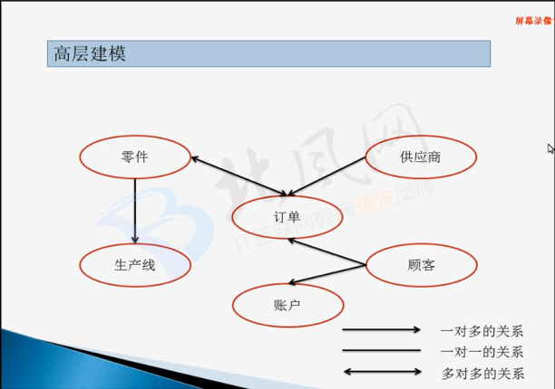

ER图-实体关系图，了解不同实体之间的关系。了解业务的最高层次的建模

##### 中间层建模

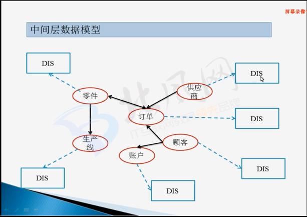

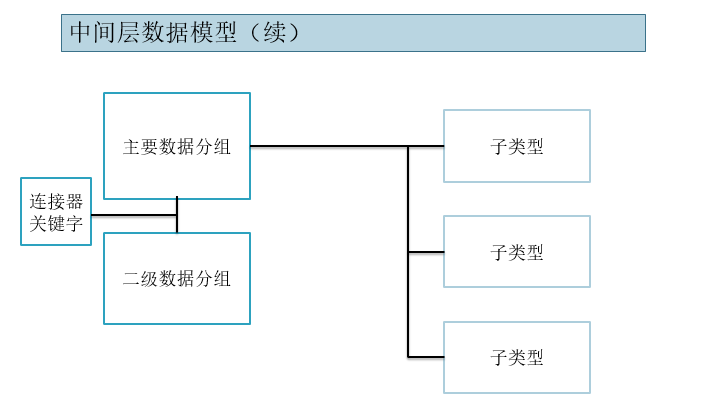

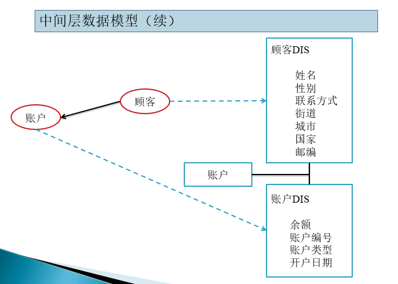

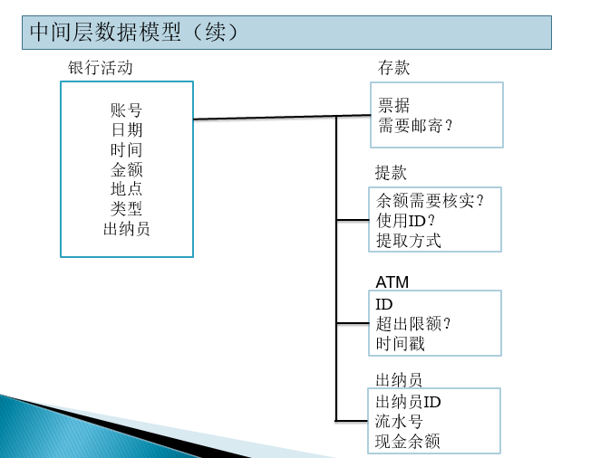

主要数据分组和二级数据分组：

- 每个主题域有且只有一个主要的数据分组，其中包含每个主题最主要的属性和关键字，只出现一次（例如顾客的基本属性）。二级数据分组（eg:一个顾客可以有多个账户）类似于数据层级（R1，R2，R3）

子类型

- 根据业务类型进行区分出主题域的子主题域

##### 物理建模

基于中间层的建模对具体的物理表进行设计，该过程也是不断迭代的过程

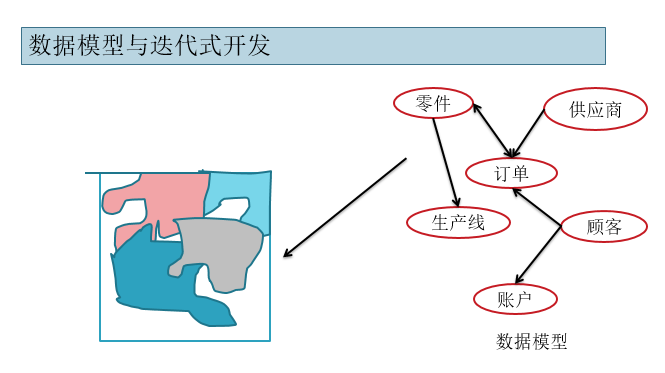

而在具体的物理建模中，需要考虑规范化/反规范化的设计

- 合并表，关联性多的表可以考虑将其合并，不要那么多小表

- 选择冗余，例如可以把维度较少的维度信息整合到事实表中，这样每次访问的时候就没必要每次都去join

  

## 2. 一些核心问题

一些想法：

数据分析的重点不在于数据而在于分析，分析针对的是业务，所以业务是首要了解的东西，就像一个人做事情，首先要明确的是要做的是什么事情；然后是网站或产品，它是实现业务的媒介，就像是做事情时使用的工作或方法；数据的处理流程包括了数据的获取、处理和存储模型，它是记录信息，可以看做是日记，记录了一个人做事情的整个流程；指标和报表就是为了将一个人做事情的整个流程复述出来，把握重点同时又不失关键细节，所以必须要了解指标的统计规则和报表的展现方式，以便更好地突显重点，了解省略的细节，让复述贴近事实。

　　很明显，当你了解了这个人在做什么事情之后再去阅读这个人在做事情时记录的信息或听取复述要远比你直接通过复述内容或者阅读记录信息来猜测这个人在做什么事情来得高效得多。

### 2.1 数据质量的把控

该部分的内容，引用一篇博客中的笔记：

> ### 分析的前提—数据质量1
>
> 　　数据质量（Data Quality）是数据分析结论有效性和准确性的基础也是最重要的前提和保障。数据质量保证（Data Quality Assurance）是数据仓库架构中的重要环节，也是ETL的重要组成部分。
>
> 　　我们通常通过数据清洗（Data cleansing）来过滤脏数据，保证底层数据的有效性和准确性，数据清洗一般是数据进入数据仓库的前置环节，一般来说数据一旦进入数据仓库，那么必须保证这些数据都是有效的，上层的统计聚合都会以这批数据作为基础数据集，上层不会再去做任何的校验和过滤，同时使用稳定的底层基础数据集也是为了保证所有上层的汇总和多维聚合的结果是严格一致的。但当前我们在构建数据仓库的时候一般不会把所有的数据清洗步骤放在入库之前，一般会把部分数据清洗的工作放在入库以后来执行，主要由于数据仓库对数据处理方面有自身的优势，部分的清洗工作在仓库中进行会更加的简单高效，而且只要数据清洗发生在数据的统计和聚合之前，我们仍然可以保证使用的是清洗之后保留在数据仓库的最终“干净”的基础数据。
>
> 　　前段时间刚好跟同事讨论数据质量保证的问题，之前做数据仓库相关工作的时候也接触过相关的内容，所以这里准备系统地整理一下。之前构建数据仓库基于Oracle，所以选择的是Oracle提供的数据仓库构建工具——OWB（Oracle Warehouse Builder），里面提供了比较完整的保证数据质量的操作流程，主要包括三块：
>
> 1. **Data Profiling**
> 2. **Data Auditing**
> 3. **Data Correcting**
>
> #### Data Profiling
>
> 　　Data Profiling，其实目前还没找到非常恰当的翻译，Oracle里面用的是“数据概要分析”，但其实“Profiling”这个词用概要分析无法体现它的意境，看过美剧Criminal Minds（犯罪心理）的同学应该都知道FBI的犯罪行为分析小组（BAU）每集都会对罪犯做一个Criminal Profiling，以分析罪犯的身份背景、行为模式、心理状态等，所以Profiling更多的是一个剖析的过程。维基百科对Data Profiling的解释如下：
>
> > Data profiling is the process of examining the data available in an existing data source and collecting statistics and information about that data.
>
> 　　这里我们看到Data Profiling需要一个收集统计信息的过程（这也是犯罪心理中Garcia干的活），那么如何让获取数据的统计信息呢？
>
> 　　熟悉数据库的同学应该知道数据库会对每张表做Analyze，一方面是为了让优化器可以选择合适的执行计划，另一方面对于一些查询可以直接使用分析得到的统计信息返回结果，比如COUNT(*)。这个其实就是简单的Data Profiling，Oracle数据仓库构建工具OWB中提供的Data Profiling的统计信息更加全面，针对建立Data Profile的表中的每个字段都有完整的统计信息，包括：
>
> 　　记录数、最大值、最小值、最大长度、最小长度、唯一值个数、NULL值个数、平均数和中位数，另外OWB还提供了six-sigma值，取值1-6，越高数据质量越好，当six-sigma的值为7的时候可以认为数据质量近乎是完美的。同时针对字段的唯一值，统计信息中给出了每个唯一值的分布频率，这个对发现一些异常数据是非常有用的，后面会详细介绍。
>
> 　　看到上面这些Data Profile的统计信息，我们可能会联想到统计学上面的统计描述，统计学上会使用一些统计量来描述一些数据集或者样本集的特征，如果我们没有类似OWB的这类ETL工具，我们同样可以借助统计学的这些知识来对数据进行简单的Profiling，这里不得不提一个非常实用的图表工具——**箱形图（****Box plot）**，也叫箱线图、盒状图。我们可以尝试用箱形图来表现数据的分布特征：
>
> 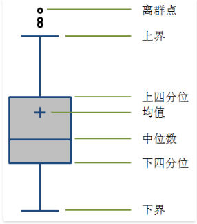
>
> 　　箱线图有很多种表现形式，上面图中的是比较常见的一种箱线图。一般中间矩形箱的上下两边分别为数据集的上四分位数（75%，Q3）和下四分位数（25%，Q1），中间的横线代表数据集的中位数（50%，Media，Q2），同时有些箱线图会用“+”来表示数据集的均值。箱形的上下分别延伸出两条线，这两条线的末端（也叫“触须”）一般是距离箱形1.5个IQR（Q3-Q1，即箱形的长度），所以上端的触须应该是Q3+1.5IQR，下端的触须是Q1-1.5IQR；如果数据集的最小值大于Q1-1.5IQR，我们就会使用最小值替换Q1-1.5IQR作为下方延伸线末端，同样如果最大值小于Q3+1.5IQR，用最大值作为上方延伸线的末端，如果最大或者最小值超出了Q1-1.5IQR到Q3+1.5IQR这个范围，我们将这些超出的数据称为离群点（Outlier），在图中打印出来，即图中在上方触须之外的点。另外，有时候我们也会使用基于数据集的标准差σ，选择上下3σ的范围，或者使用置信水平为95%的置信区间来确定上下边界的末端值。
>
> 　　其实箱线图没有展现数据集的全貌，但通过对数据集几个关键统计量的图形化表现，可以让我们看清数据的整体分布和离散情况。
>
> 　　既然我们通过Data profiling已经可以得到如上的数据统计信息，那么如何利用这些统计信息来审核数据的质量，发现数据可能存在的异常和问题，并对数据进行有效的修正，或者清洗，进而得到“干净”的数据，这些内容就放到下一篇文章吧。
>
> 
>
> 
>
> 
>
> ### 分析的前提—数据质量2
>
> 　　前一篇文章介绍了数据质量的一些基本概念，数据质量控制作为数据仓库的基础环节，是保障上层数据应用的基础。数据质量保证主要包括**数据概要分析（****Data Profiling）**、**数据审核（****Data Auditing）**和**数据修正（****Data Correcting）**三个部分，前一篇文章介绍了[Data Profiling](http://webdataanalysis.net/data-collection-and-preprocessing/data-quality-1/)的相关内容，从Data Profiling的过程中获得了数据的概要统计信息，所以下面就要用这些数据统计信息来审核数据的质量，检查数据中是否存在脏数据，所以这一篇主要介绍数据审核（Data Auditing）的内容。
>
> ### 数据质量的基本要素
>
> 　　首先，如何评估数据的质量，或者说怎么样的数据才是符合要求的数据？可以从4个方面去考虑，这4个方面共同构成了数据质量的4个基本要素。
>
> 
>
> #### 完整性
>
> 　　数据的记录和信息是否完整，是否存在缺失的情况。
>
> 　　数据的缺失主要有记录的缺失和记录中某个字段信息的缺失，两者都会造成统计结果的不准确，所以完整性是数据质量最基础的保障，而对完整性的评估相对比较容易。
>
> #### 一致性
>
> 　　数据的记录是否符合规范，是否与前后及其他数据集合保持统一。
>
> 　　数据的一致性主要包括数据记录的规范和数据逻辑的一致性。数据记录的规范主要是数据编码和格式的问题，比如网站的用户ID是15位的数字、商品ID是10位数字，商品包括20个类目、IP地址一定是用”.”分隔的4个0-255的数字组成，及一些定义的数据约束，比如完整性的非空约束、唯一值约束等；数据逻辑性主要是指标统计和计算的一致性，比如PV>=UV，新用户比例在0-1之间等。数据的一致性审核是数据质量审核中比较重要也是比较复杂的一块。
>
> #### 准确性
>
> 　　数据中记录的信息和数据是否准确，是否存在异常或者错误的信息。
>
> 　　导致一致性问题的原因可能是数据记录的规则不一，但不一定存在错误；而准确性关注的是数据记录中存在的错误，比如字符型数据的乱码现象也应该归到准确性的考核范畴，另外就是异常的数值，异常大或者异常小的数值，不符合有效性要求的数值，如访问量Visits一定是整数、年龄一般在1-100之间、转化率一定是介于0到1的值等。对数据准确性的审核有时会遇到困难，因为对于没有明显异常的错误值我们很难发现。
>
> #### 及时性
>
> 　　数据从产生到可以查看的时间间隔，也叫数据的延时时长。
>
> 　　虽然说分析型数据的实时性要求并不是太高，但并不意味了就没有要求，分析师可以接受当天的数据要第二天才能查看，但如果数据要延时两三天才能出来，或者每周的数据分析报告要两周后才能出来，那么分析的结论可能已经失去时效性，分析师的工作只是徒劳；同时，某些实时分析和决策需要用到小时或者分钟级的数据，这些需求对数据的时效性要求极高。所以及时性也是数据质量的组成要素之一。
>
> ### Data Auditing
>
> 　　基于数据质量的4个要素，可以对数据进行审核，以评估数据是否满足完整性、一致性、准确性和及时性这4方面的要求，其中数据的及时性主要跟数据的同步和处理过程的效率相关，更多的是通过监控ETL任务的方式来保证数据的及时性，所以这里的数据审核主要指的是评估数据的完整性、一致性和准确性。
>
> #### 完整性
>
> 　　我们从Data Profiling得到的数据统计信息里面看看哪些可以用来审核数据的完整性。首先是记录的完整性，一般使用统计的记录数和唯一值个数。比如网站每天的日志记录数是相对恒定的，大概在1000万上下波动，如果某天的日志记录数下降到了只有100万，那很有可能记录缺失了；或者网站的访问记录应该在一天的24小时均有分布，如果某个整点完全没有用户访问记录，那么很有可能网站在当时出了问题或者那个时刻的日志记录传输出现了问题；再如统计访客的地域分布时，一般会包括全国的32个省份直辖市，如果统计的省份唯一值个数少于32，那么很有可能数据也存在缺失。
>
> 　　完整性的另一方面，记录中某个字段的数据缺失，可以使用统计信息中的空值（NULL）的个数进行审核。如果某个字段的信息理论上必然存在，比如访问的页面地址、购买的商品ID等，那么这些字段的空值个数的统计就应该是0，这些字段我们可以使用非空（NOT NULL）约束来保证数据的完整性；对于某些允许空的字段，比如用户的cookie信息不一定存在（用户禁用cookie），但空值的占比基本恒定，比如cookie为空的用户比例通常在2%-3%，我们同样可以使用统计的空值个数来计算空值占比，如果空值的占比明显增大，很有可能这个字段的记录出现了问题，信息出现缺失。
>
> #### 一致性
>
> 　　如果数据记录格式有标准的编码规则，那么对数据记录的一致性检验比较简单，只要验证所有的记录是否满足这个编码规则就可以，最简单的就是使用字段的长度、唯一值个数这些统计量。比如对用户ID的编码是15位数字，那么字段的最长和最短字符数都应该是15；或者商品ID是P开始后面跟10位数字，可以用同样的方法检验；如果字段必须保证唯一，那么字段的唯一值个数跟记录数应该是一致的，比如用户的注册邮箱；再如地域的省份直辖市一定是统一编码的，记录的一定是“上海”而不是“上海市”、“浙江”而不是“浙江省”，可以把这些唯一值映射到有效的32个省市的列表，如果无法映射，那么字段通不过一致性检验。
>
> 　　一致性中逻辑规则的验证相对比较复杂，很多时候指标的统计逻辑的一致性需要底层数据质量的保证，同时也要有非常规范和标准的统计逻辑的定义，所有指标的计算规则必须保证一致。我们经常犯的错误就是汇总数据和细分数据加起来的结果对不上，导致这个问题很有可能的原因就是数据在细分的时候把那些无法明确归到某个细分项的数据给排除了，比如在细分访问来源的时候，如果我们无法将某些非直接进入的来源明确地归到外部链接、搜索引擎、广告等这些既定的来源分类，但也不应该直接过滤掉这些数据，而应该给一个“未知来源”的分类，以保证根据来源细分之后的数据加起来还是可以与总体的数据保持一致。如果需要审核这些数据逻辑的一致性，我们可以建立一些“有效性规则”，比如A>=B，如果C=B/A，那么C的值应该在[0,1]的范围内等，数据无法满足这些规则就无法通过一致性检验。
>
> #### 准确性
>
> 　　数据的准确性可能存在于个别记录，也可能存在于整个数据集。如果整个数据集的某个字段的数据存在错误，比如常见的数量级的记录错误，这种错误很容易发现，利用Data Profiling的平均数和中位数也可以发现这类问题。当数据集中存在个别的异常值时，可以使用最大值和最小值的统计量去审核，或者使用箱线图也可以让异常记录一目了然。
>
> 　　还有几个准确性的审核问题，字符乱码的问题或者字符被截断的问题，可以使用分布来发现这类问题，一般的数据记录基本符合正态分布或者类正态分布，那么那些占比异常小的数据项很可能存在问题，比如某个字符记录占总体的占比只有0.1%，而其他的占比都在3%以上，那么很有可能这个字符记录有异常，一些ETL工具的数据质量审核会标识出这类占比异常小的记录值。对于数值范围既定的数据，也可以有效性的限制，超过数据有效的值域定义数据记录就是错误的。
>
> 　　如果数据并没有显著异常，但仍然可能记录的值是错误的，只是这些值与正常的值比较接近而已，这类准确性检验最困难，一般只能与其他来源或者统计结果进行比对来发现问题，如果使用超过一套数据收集系统或者网站分析工具，那么通过不同数据来源的数据比对可以发现一些数据记录的准确性问题。
>
> 　　上面已经从Data Profiling的统计信息中，通过Data Auditing发现了数据质量上存在的一些问题，那么接下来就要针对这些问题对数据进行清洗和修正，也就是下一篇文章中要介绍的内容——Data Correcting，数据修正。
>
> 
>
> 
>
> 
>
> 
>
> 
>
> 
>
> ### 分析的前提—数据质量3
>
> 
>
> 　　前面的两篇文章——[分析的前提—数据质量1](http://webdataanalysis.net/data-collection-and-preprocessing/data-quality-1/)和[分析的前提—数据质量2](http://webdataanalysis.net/data-collection-and-preprocessing/data-quality-2/)分别介绍了通过Data Profiling的方法获取数据的统计信息，并使用Data Auditing来评估数据是否存在质量问题，数据的质量问题可以通过完整性、准确性和一致性三个方面进行审核。这篇文章介绍最后一块内容——**数据修正（****Data Correcting）**。
>
> 　　数据审核帮助我们发现数据中存在的问题，而这些问题有时候可以利用一些方法就行修正，从而提升数据的整体质量，数据修正就是为了完成这个任务，可以从以下几个方面进行修正：
>
> ### 填补缺失值
>
> 　　对于记录缺失的问题，最简单的办法就是数据回补。一般而言统计指标数据缺失可以从原始数据中重新统计获取，而原始数据缺失可以从抽取的数据源或者备份数据中回补。如果原始数据完全丢失，基本就回天无力了。
>
> 　　对于字段值的缺失，很多资料都会介绍使用一些统计学的方法进行修补，其实就是对缺失值的预测或者估计，一般会使用平均数、众数、前后值取平均等方法，或者使用回归分析的方法拟合指标的变化趋势后进行预测。这些方法在缺失值无法使用其他途径找回或者重新统计计算，并且在缺失值有变化规律可循的前提下都是可取的，当某天的指标值丢失时可以通过这类方法根据前几天的数据来预估该天的数值。但很多时候网站分析中如果底层的日志存在缺失值，我们很难预测具体的缺失值，因为访问的细节几乎是无迹可寻的，所以对于访问记录存在缺失值并且这些字段的缺失会明显影响一些统计指标的计算时，最简单的方法就是舍弃该记录，但这种直接过滤掉缺失记录的方法一些只会用于访问日志等不需要非常精确的数据上，如果是网站的运营、交易等这些需要保证完全计算准确的数据绝对是不能直接舍弃的，而且对于访问日志中缺失或者异常记录的过滤也需要基于对这类数据的统计基础上，一般的原则是不太重要的字段如果缺失或者异常的记录占比小于1%或者5‰的情况下可以选择过滤这些记录，如果占比比较高，需要进一步排查日志记录是否存在问题。
>
> ### 删除重复记录
>
> 　　数据集里面某些字段的值必然是唯一的，比如按天统计的指标值中的日期字段，用户信息表的用户ID等，这些需要保证唯一的规则可以对数据库设置唯一约束，但我们在做ETL处理时，有时为了保证数据加载全过程可以不因为违反唯一约束而中断（有时Load的过程需要较长的时间或处理成本，ETL需要有容错能力以保证整个过程不被中断）会先忽略重复记录，待整个ETL过程结束后再对需要保证唯一的字段进行去重处理。
>
> 　　这些重复记录可以比对Data Profiling中数据统计信息的唯一值个数和记录总数是否一致进行审核，而进行修正的最简单办法就是重复记录仅保留一条，删除其他记录。这个需要根据现实情况，有时也可能使用把重复记录的统计量相加的方法进行去重。
>
> ### 转化不一致记录
>
> 　　数据的转化是数据仓库抽取数据过程中最常见的处理，因为数据仓库“集成性”的特征，需要把来自多个数据源的数据集中存入数据仓库，而不同数据源对某些含义相同的字段的编码规则会存在差异，比如用户ID，虽然是相同的用户，但可能A系统的ID是u1001，B系统是1001，C系统是100100，来源于这三套系统的用户ID就需要统一，比如我们将A数据源的u前缀去除，C系统ID除100后统一成B系统的编码方式一起导入数据库；即使是来源于同一套日志，也可能存在记录的不一致，比如之前遇到较早发布的产品版本记录的日志中移动操作系统是Android，而版本更新后记录改成了android，新老版本的日志打到了一起，于是也会涉及数据的转化，但这种记录的不一致性无疑会增加ETL的处理成本。
>
> 　　上面举例的转化规则是比较简单的，在数据仓库的ETL处理数据转化时可能会遇到一些很BT的规则，这个时候最关键的还是对数据源记录方式足够的熟悉，这样才能保证进入数据仓库的数据是一致的。最好的做法就是数据仓库的开发工程师与其他前台系统的开发人员能事先约定一套统一的数据记录和编码的方式，这样可以减少后期的协调沟通和转化处理成本。
>
> ### 处理异常数据
>
> 　　异常数据大部分情况是很难修正的，比如字符编码等问题引起的乱码，字符被截断，异常的数值等，这些异常数据如果没有规律可循几乎不可能被还原，只能将其直接过滤。
>
> 　　有些数据异常则可以被还原，比如原字符中参杂了一些其他的无用字符，可以使用取子串的方法，用trim函数可以去掉字符串前后的空格等；字符被截断的情况如果可以使用截断后字符推导出原完整字符串，那么也可以被还原，比如移动操作系统的记录一般包括Symbian、Android、iPhone、BlackBerry等，如果某些记录的是And，那么可以被还原成Android，因为其他的移动操作系统被截断不可能出现And这种记录。数值记录中存在异常大或者异常小的值是可以分析是否数值单位差异引起的，比如克和千克差了1000倍，美元和人民币存在汇率的差异，时间记录可能存在时区的差异，百分比用的是小于1的小数还是已经乘了100等等，这些数值的异常可以通过转化进行处理，数值单位的差异也可以认为是数据的不一致性，或者是某些数值被错误的放大或缩小，比如数值后面被多加了几个0导致了数据的异常。
>
> 　　最后，总结一下数据可修正的前提：1) 数据质量的问题可以通过Data Auditing的过程被审核出来；2) 数据的问题必须有迹可循，可以通过趋势进行预测或者可以通过一些规则进行转换还原。否者，对于异常数据只能直接进行删除丢弃，但进行数据过滤之前必须评估异常记录的比例，当占比过高时需要重新审核原始数据的记录方式是否存在问题。

### 2.2 数仓搭建中的QA

**Q1、数据仓库是否就应该保存聚合数据，细节数据不应该放入数据仓库？**

　　其实这个问题基本已经达成共识，如果是构建企业级的数据仓库，那么对细节数据的集成和存储是必不可少的，但现实中还是存在很多直接从外部数据源计算聚合之后导入数据仓库的实例。如果对数据仓库只是轻量级的应用，仅存放聚合数据也无可厚非，毕竟没人规定数据仓库一定要是怎么样的，最终的目的无非就是满足对数据的支持和需求。

　　但对于企业的长期发展来看，数据仓库中存放细节数据有两方面的好处：一方面从技术层面，数据仓库存储细节数据可以释放前台数据库的查询压力，同时对于文本类数据和外部文档类数据入库之后管理更加规范，数据仓库保留历史和不可变更的特性可以让信息不被丢失；另一方面就是从数据的使用上，数据仓库让数据的获取和使用更加简便，集成细节数据让大量的文本型数据可查询，可关联，而面向主题的设计让数据的展现和分析更有方向性和目的性，而且细节数据是支持数据分析和数据挖掘应用所必不可少的。所以，如果数据仓库要不断地催生出更大的价值，细节数据的存储是必不可少的。

**Q2、你会把数据仓库分为几层，每层的数据作用是什么？**

没有标准答案，根据数据仓库中数据的复杂性和对数据使用的需求程度，数据仓库可以有不用的层级划分。

我一般会把数据仓库划成三层：

- 最底层的细节数据，管理策略是优化存储，一般存储导入的原始数据，便于进行向上的统计汇总，因为数据量较大所以需要优化存储；
- 中间层是多维模型，管理策略是优化结构和查询，面向主题的多维模型的设计，需要满足OLAP和数据查询的多样需求，同时保证查询的便捷性，关键在与维表的设计和维度的选择及组合，事实表需要关注存储和索引的优化；
- 最上层是展现数据，管理策略是优化效率，一般会存放每天需要展现的汇总报表，或者根据多维模型拼装的视图，展现层的数据需要以最快的速度展现出来，一般用于BI平台的Dashboard和报表。

**Q3、数据仓库搭建中最繁杂的事情是什么，最容易缺失的是哪一块？**

　　一直觉得数据仓库的核心不在于数据集成，当然数据集成是数据仓库实现价值的前提，数据仓库真正的价值体现在数据的有效应用，数据源于业务反作用于业务。而搭建数据仓库的核心在于数据仓库的架构和数据模型的设计，怎么权衡数据的存储和数据获取效率之间的矛盾是数据仓库管理上的难点，这个难点任何数据仓库都会存在，而大数据增大了这种权衡中的难度。而数据的集成和数据质量控制是数据仓库搭建中最繁杂的事情，尤其是数据清洗的过程，我之前也写过几篇数据质量控制的文章，但现实中这个过程还要复杂得多，而且为了上层数据产出的准确性和有效性，这项工作又不得不做，而且要做得尽量细致。

　　搭建数据仓库中最容易缺失的就是对元数据的管理，很少有数据仓库团队具备完整的元数据，当然搭建数据仓库的工程师本身就是活的元数据，但无论是为了用数据的人还是数据仓库自身的团队着想，元数据都不可或缺。一方面元数据为数据需求方提供了完整的数据仓库使用文档，帮助他们能自主地快速获取数据，另一方面数据仓库团队成员可以从日常的数据解释中解脱出来，无论是对后期的不断迭代更新和维护还是培训新的员工，都非常有好处，元数据可以让数据仓库的应用和维护更加高效。

